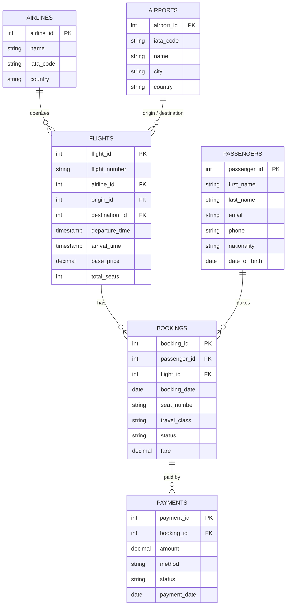

# ✈️ Airline Booking System — SQL Project

A PostgreSQL database that manages **airlines, airports, flights, passengers, bookings and payments**, plus a set of SQL queries that analyse booking trends, revenue, popular destinations, flight details and passenger behaviour.

**Skills demonstrated:** SQL · Database design · Joins · Aggregations · Subqueries · CTEs · Window functions · Views · Indexing · Constraints

---

## 📁 Repository Structure

```
airline-booking-system/
├── README.md
├── sql/
│   └── airline_booking_postgres.sql   # schema + sample data + 18 analysis queries
└── screenshots/
    ├── er_diagram.png
    ├── revenue_by_airline.png
    └── top_destinations.png
```

## 🚀 How to Run

```bash
createdb -U postgres airline_booking
psql -U postgres -d airline_booking -f sql/airline_booking_postgres.sql
```

Requires PostgreSQL 14 or newer. The script drops and recreates all tables, so it can be re-run safely.

---

## 🗂️ Database Design



**Design highlights**

- Primary and foreign keys enforce referential integrity across all six tables.
- `CHECK` constraints validate travel class, booking status, payment status, positive prices, and that arrival is after departure.
- `UNIQUE (flight_id, seat_number)` prevents the same seat being sold twice on a flight.
- Indexes on foreign keys and `booking_date` support the joins and date grouping used in the analysis.
- The `v_flight_details` view simplifies the three-table join between flights, airlines and airports.

---

## 📊 Analysis & Key Findings

The queries run on a small sample dataset (6 airlines, 8 airports, 14 flights, 12 passengers, 32 bookings), so the figures illustrate the analysis rather than represent real airline data.

| Question | SQL techniques | Finding |
|---|---|---|
| Total revenue? | `SUM`, `WHERE` | 13,86,300 from paid bookings |
| Which airline earns most? | multi-table `JOIN`, `GROUP BY` | Emirates (4,56,000), followed by British Airways and Air India |
| Most popular destinations? | `GROUP BY`, `ORDER BY`, `LIMIT` | Bengaluru (6 bookings), then Delhi and London (5 each) |
| How do bookings trend monthly? | `TO_CHAR`, CTE, `LAG` | Bookings peaked in February 2026 (11) and fell 27.3% in March |
| Which travel class earns most? | `SUM() OVER ()` | Economy 48%, Business 33.6%, First 18.4% |
| Which airline loses most to cancellations? | conditional aggregation (`CASE`) | Air India (20%), then IndiGo (16.7%) |
| Who are the highest-value passengers? | subquery in `HAVING` | Five passengers spend above the average |
| Who are the frequent flyers? | `GROUP BY`, `HAVING` | Seven passengers with 3+ trips |
| Which payments need follow-up? | `JOIN`, filtering | Two pending payments, with contact details |
| Top-earning route per airline? | CTE, `RANK() OVER (PARTITION BY ...)` | Emirates' Dubai → New York leads at 3,51,000 |

### Example query — month-over-month booking growth

```sql
WITH monthly AS (
    SELECT TO_CHAR(booking_date, 'YYYY-MM') AS month, COUNT(*) AS bookings
    FROM bookings
    GROUP BY month
)
SELECT month,
       bookings,
       LAG(bookings) OVER (ORDER BY month) AS prev_month,
       ROUND(100.0 * (bookings - LAG(bookings) OVER (ORDER BY month))
                   / LAG(bookings) OVER (ORDER BY month), 1) AS growth_pct
FROM monthly;
```

---

## 🧠 What I Learned

- Designing a normalised relational schema and enforcing rules with constraints instead of application code.
- Combining data across many tables with inner and left joins, including joining one table twice under different roles.
- Turning business questions (revenue, cancellations, popular routes) into aggregate queries.
- Using CTEs and window functions for trends and rankings.

## 🔭 Possible Extensions

- Add a `seats` table and `flight_status` (on time, delayed, cancelled).
- Add loyalty points per passenger and a `crew` table.
- Build a dashboard in Power BI, Tableau or Metabase on top of the queries.
- Add stored functions, e.g. `book_seat(passenger_id, flight_id, seat, class)` with transaction handling.
